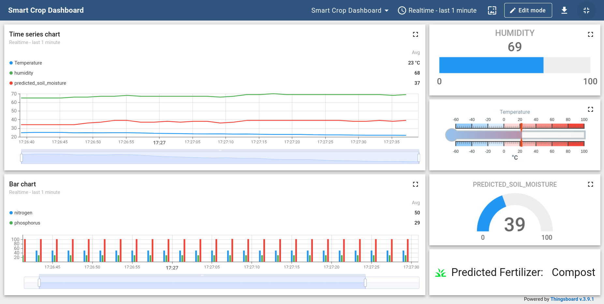

# Smart Crop Monitoring System with IoT, AI/ML and Real-Time Dashboard

This project combines IoT sensors and machine learning to optimize agriculture. It collects real-time data on temperature, humidity, and soil nutrients, predicts soil moisture, and recommends fertilizers. The user-friendly ThingsBoard dashboard visualizes this data, enabling farmers to make informed decisions for improved crop yields and sustainable practices.

## Features

- Real-time monitoring of temperature, humidity, and NPK levels
- AI-powered soil moisture prediction
- Machine learning-based fertilizer recommendation
- Interactive ThingsBoard dashboard for data visualization
- MQTT integration for efficient data transmission
- Simulated sensor data generation using a Python script

## Dashboard Preview

## Technologies Used

- Python
- ThingsBoard
- MQTT
- Scikit-learn (RandomForestRegressor, RandomForestClassifier)
- NumPy
- Pandas

## Setup and Installation

1. Clone the repository
2. Set up a Conda environment (make sure you have Anaconda or Miniconda installed):
`conda create -n crop_monitoring python=3.8`
`conda activate crop_monitoring`
3. Install required Python packages: `pip install -r requirements.txt`
4. Set up ThingsBoard locally or use ThingsBoard Cloud
5. Configure MQTT credentials in the Python script
6. Run the Python script to simulate sensor data: `python smart_crop_monitoring.py`
   

## Usage

1. Ensure your IoT sensors are connected and sending data (or use the simulated data)
2. Open the ThingsBoard dashboard
3. Monitor real-time data and AI/ML predictions
4. Use insights for precision agriculture decisions

## Future Enhancements

- Integration with additional types of sensors
- Cloud deployment for scalability
- Mobile app development for on-the-go monitoring

## Contributing

Contributions are welcome! Please feel free to submit a Pull Request.
